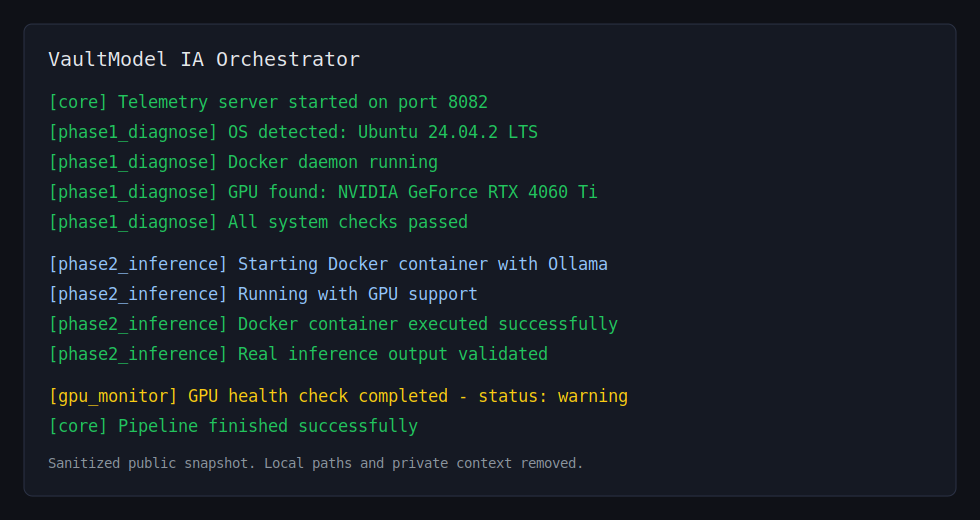
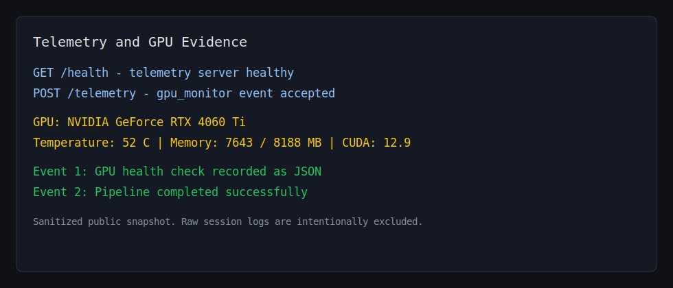

# Local LLM Inference on Docker + GPU

[](https://github.com/javieralonso-ai/llm-inference-docker-gpu/actions/workflows/validate.yml)
[](LICENSE)
[](https://www.python.org/)
[](https://www.docker.com/)
[](https://developer.nvidia.com/cuda-toolkit)
[](https://ollama.com/)

Functional prototype and case study for local LLM inference on a GPU-enabled Linux machine.

This repository started as a systems take-home style assignment and was extended into a local inference demo with Ollama, Docker, GPU diagnostics, a CLI, JSONL logs, and HTTP telemetry. It is intended as a reviewer-friendly technical artifact, not as an official product or enterprise production platform.

## What This Demonstrates

| Area | Evidence in this repo |
|---|---|
| Local LLM inference | `ModelVault_System` runs Ollama/Mistral through a Docker-based workflow |
| GPU-aware operations | `nvidia-smi` diagnostics, GPU health JSON, terminal dashboard |
| Docker/Linux systems work | Docker image, container startup, host diagnostics, shell orchestration |
| CLI experience | Interactive Python CLI for running the pipeline, viewing logs, and chatting |
| Observability | JSONL execution logs, inference logs, telemetry endpoint, sample evidence |
| Operational thinking | Session directories, health checks, lock intent, systemd design draft |

## Repository Layout

| Path | Purpose | Status |
|---|---|---|
| `MiniVault_stub/` | Baseline assignment implementation: diagnostics, simulated inference, structured logging, and optional systems features | Demonstration baseline |
| `ModelVault_System/` | Extended local LLM prototype with Docker, Ollama, CLI, GPU monitoring, telemetry, and benchmark helpers | Functional local demo |
| `docs/case-study.md` | Public case study with context, design decisions, evidence, and limitations | Reviewer entry point |
| `docs/evidence/` | Sanitized execution samples and clean visual snapshots | Safe to review publicly |

## Quickstart

Requirements:

- Ubuntu 22.04+ or WSL2 Ubuntu
- Python 3.10+
- Docker running
- NVIDIA driver and NVIDIA Container Toolkit for GPU acceleration
- Internet access on first run to download the Ollama model

Clone and install host-side Python dependencies:

```bash
git clone https://github.com/javieralonso-ai/llm-inference-docker-gpu.git
cd llm-inference-docker-gpu
python3 -m pip install -r requirements.txt
```

Run the baseline assignment implementation:

```bash
cd MiniVault_stub
find . -name "*.sh" -exec chmod +x {} \;
./vaultmodel_core.sh
```

Run the extended local inference demo:

```bash
cd ../ModelVault_System
find . -name "*.sh" -exec chmod +x {} \;
python3 vaultmodel_cli_basic.py
```

The extended demo will:

- run OS, Docker, Python, and GPU diagnostics;
- start the local inference pipeline;
- run Ollama through the Docker workflow;
- write session logs under `logs/sessions/`;
- expose telemetry during the run;
- open a CLI menu for log inspection and chat.

## Evidence

The raw local logs are intentionally not committed because they include machine paths and environment-specific details. Sanitized samples are included instead:

- [Case study](docs/case-study.md)
- [Evidence index](docs/evidence/README.md)
- [Execution JSONL sample](docs/evidence/execution.sample.jsonl)
- [GPU health sample](docs/evidence/gpu_health.sample.json)
- [Telemetry JSONL sample](docs/evidence/telemetry.sample.jsonl)
- [System report sample](docs/evidence/system_report.sample.md)

Clean visual snapshots:





## Tested Evidence

The public evidence in this repo is based on a local run with:

| Component | Observed value |
|---|---|
| OS | Ubuntu 24.04.2 LTS on WSL2 |
| GPU | NVIDIA GeForce RTX 4060 Ti |
| Docker | 28.3.2 |
| Python | 3.12.3 |
| CUDA reported by driver | 12.9 |
| Runtime | Ollama with Mistral |
| Inference evidence | Successful Docker workflow, real output file, JSONL logs, telemetry events |

## Honest Scope

This is:

- a technical assessment reconstruction;
- a functional local prototype;
- a demonstration of systems thinking around local AI inference;
- a portfolio artifact for AI infrastructure, LLMOps, and GPU-aware tooling.

This is not:

- an official ModelVault product;
- affiliated with or endorsed by ModelVault;
- a production enterprise platform;
- a complete multi-GPU scheduler;
- a hardened network service;
- a Kubernetes or cloud deployment.

## Roadmap

Short next steps:

- extend CI with link checks and a lightweight smoke test for documented commands;
- replace the current shell lock with a verified `flock`-based implementation;
- either implement the baseline Docker stub end-to-end or document it strictly as host simulation;
- redesign and test the systemd unit before presenting it as deployable;
- add a fresh GPU run with updated hardware only when reproducible evidence exists.

## Author

Built by Javier Alonso as an AI systems and local inference portfolio project.

## License

MIT. See [LICENSE](LICENSE).
