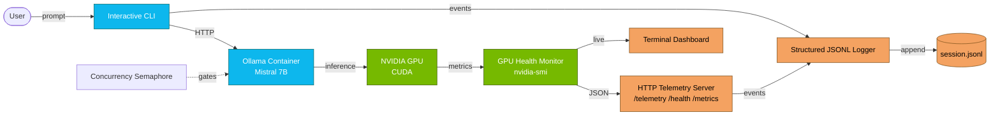

# LLM Inference on Docker + GPU

[](https://opensource.org/licenses/MIT)
[](https://www.python.org/)
[](https://www.docker.com/)
[](https://developer.nvidia.com/cuda-toolkit)
[](https://ollama.ai/)

On-premise LLM inference system with Docker, Ollama, GPU monitoring, structured logging and HTTP telemetry. Built as a technical assessment for **ModelVault** (on-premise AI appliances startup) — delivered 3 days ahead of deadline with **2× the requested scope**.

> *"I believe you would be a great fit for our team."* — ModelVault Hiring Manager

---

## Context

ModelVault asked for a ~2 hour bootstrap script with Docker + logging, plus **one** of three optional bonuses.
I delivered **two complete projects**: the original exercise with **all three bonuses**, and a fully working LLM inference system on top of it.

---

## What's Inside

### `MiniVault_stub/` — The assignment + 3/3 bonuses

| Feature | Status |
|---|---|
| GPU detection (`nvidia-smi`, Docker, CUDA) | ✅ |
| Docker container with structured JSONL logging | ✅ |
| **Bonus 1** — GPU health monitoring (temp / mem / util as JSON) | ✅ |
| **Bonus 2** — systemd service with security hardening | ✅ |
| **Bonus 3** — HTTP telemetry server (`POST /telemetry`, `GET /health`, `GET /metrics`) | ✅ |

### `ModelVault_System/` — Beyond requirements

A real LLM inference platform built on top of the bootstrap:

- **Mistral 7B** inference via **Ollama** in Docker
- **Interactive CLI chat** interface
- **Live GPU dashboard** in the terminal (temperature, memory, utilisation, power)
- **Multi-model benchmark** suite (latency, throughput, tokens/s)
- **Semaphore-based concurrency control** to prevent GPU contention
- **Structured logging telemetry** with JSONL events

---

## Architecture



---

## Quickstart

**Requirements:** Ubuntu 22.04+, Docker, NVIDIA driver + Container Toolkit, Python 3.10+.

```bash
# 1. Clone
git clone https://github.com/javieralonso-ai/llm-inference-docker-gpu.git
cd llm-inference-docker-gpu

# 2. Run the assessment bootstrap (with all 3 bonuses)
cd MiniVault_stub
./bootstrap.sh

# 3. Spin up the full inference system
cd ../ModelVault_System
docker compose up -d
python cli_chat.py
```

Each subfolder ships its own detailed README with options, env vars and troubleshooting.

---

## Tech Stack

| Layer | Choice |
|---|---|
| Language | Python 3.10+, Bash |
| LLM runtime | Ollama (Mistral 7B) |
| Containers | Docker + Docker Compose |
| GPU | NVIDIA CUDA 12.x, `nvidia-smi`, NVIDIA Container Toolkit |
| Service mgmt | systemd (with hardening: `NoNewPrivileges`, `ProtectSystem`, `PrivateTmp`) |
| Observability | JSONL structured logs, HTTP telemetry endpoints |
| Concurrency | Python semaphores |

---

## Hardware Tested

- **GPU**: NVIDIA RTX 5090 32 GB + RTX 5070 Ti 16 GB
- **CPU**: AMD Ryzen 9 9950X / Ryzen 7 9700X
- **RAM**: 160 GB DDR5
- **OS**: Ubuntu 22.04 LTS

The system is designed to scale down: it also runs on a single mid-range GPU (≥ 8 GB VRAM) with smaller models.

---

## Design Notes

A few decisions worth flagging for reviewers:

1. **Telemetry as a separate process**, not embedded in the inference path — keeps the hot path clean and lets observability fail without taking down inference.
2. **JSONL over a database** for the assignment scope — append-only, greppable, trivially shipped to any log pipeline (Loki, Vector, ELK).
3. **Semaphore at the application layer**, not just Ollama's queue — gives explicit back-pressure and lets the caller decide between blocking and rejecting.
4. **systemd hardening** even for a take-home — production hygiene shouldn't be a checkbox enabled later.

---

## About

Built solo by [Javier Alonso](https://github.com/javieralonso-ai), AI Engineer based in Valladolid (Spain).
Two decades operating production infrastructure 24/7, now applying that discipline to AI systems.

📫 esejavito@gmail.com · [LinkedIn](https://linkedin.com/in/javieralonso-ai)

---

## License

MIT — see [LICENSE](LICENSE).
