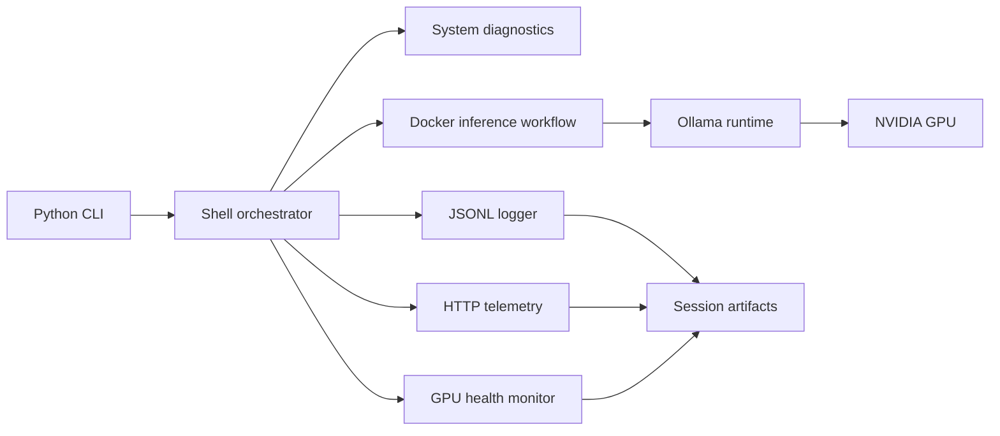

# Case Study: From Systems Assignment to Local LLM Prototype

## Summary

This project began as a systems engineering assignment around a local AI appliance bootstrap flow. The baseline implementation covers system diagnostics, Docker-oriented execution, structured logging, and optional operational features. A second implementation extends the baseline into a functional local LLM prototype using Ollama and an NVIDIA GPU.

The goal of this public version is to show how a short technical challenge can be turned into an evaluable system: runnable entrypoints, clear architecture, logs, telemetry, and documented limits.

## Problem Framing

The assignment context was a local AI appliance: a machine that should be able to check its own readiness, run an inference-style workload, write useful logs, and expose enough operational signals for troubleshooting.

I treated the problem as two layers:

| Layer | Purpose |
|---|---|
| Baseline bootstrap | Demonstrate the requested systems workflow: diagnostics, logging, inference simulation, monitoring, and service management artifacts |
| Extended prototype | Show the same idea with a real local LLM runtime: Ollama, Docker, GPU detection, CLI workflow, telemetry, and session logs |

## Architecture

## What Was Built

- A baseline assignment implementation under `MiniVault_stub/`.
- An extended demo under `ModelVault_System/`.
- A Python CLI for running the pipeline, opening chat, and inspecting logs.
- Bash orchestration for diagnostics, inference, telemetry, GPU health, and session lifecycle.
- Docker files for the inference workflow.
- JSONL logs and telemetry samples for reproducibility and review.
- A systemd unit draft and install helper as operational design artifacts.

## Evidence Available

The sanitized samples in `docs/evidence/` are derived from a local run that showed:

- Ubuntu 24.04.2 LTS environment detection.
- Docker 28.3.2 installed and running.
- NVIDIA GeForce RTX 4060 Ti detected.
- Docker container execution with GPU support.
- Real inference output generated by the extended system.
- GPU health collected as JSON.
- Telemetry events received over HTTP.
- Session logs written as JSONL.

## Important Limits

This public version deliberately avoids overstating maturity.

- The baseline project includes a simulation path and should be read as an assignment baseline.
- The extended project demonstrates a local prototype, not a production platform.
- The systemd unit is a design draft until tested end-to-end under systemd.
- The concurrency lock expresses the intended behavior, but should be replaced with a verified `flock` implementation before being treated as production behavior.
- The current public evidence is for a single-GPU RTX 4060 Ti setup. Any newer hardware claims require fresh logs or screenshots.
- Raw logs, emails, interview preparation, CV files, videos, and private process context are intentionally kept out of the repo.

## Reviewer Guide

If you have 60 seconds:

1. Read the root README.
2. Scan `ModelVault_System/vaultmodel_cli_basic.py`.
3. Open `docs/evidence/execution.sample.jsonl`.

If you have 5 minutes:

1. Read this case study.
2. Review `ModelVault_System/src/run_inference.sh`.
3. Review `ModelVault_System/docker/inference_engine.py`.
4. Check `docs/evidence/gpu_health.sample.json` and `telemetry.sample.jsonl`.

If you want to run it:

1. Use the root README quickstart.
2. Start with `MiniVault_stub`.
3. Then run `ModelVault_System` on a Docker-enabled Linux or WSL2 machine.
